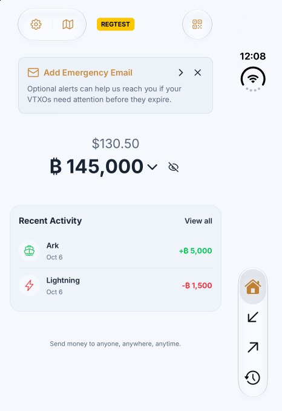
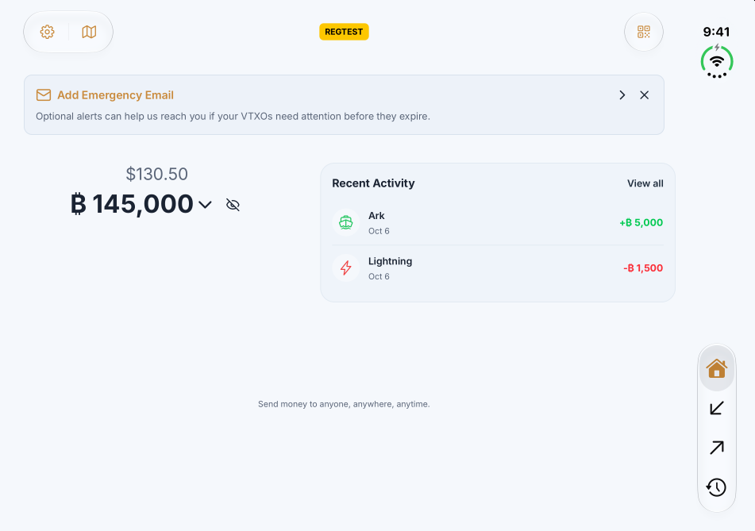
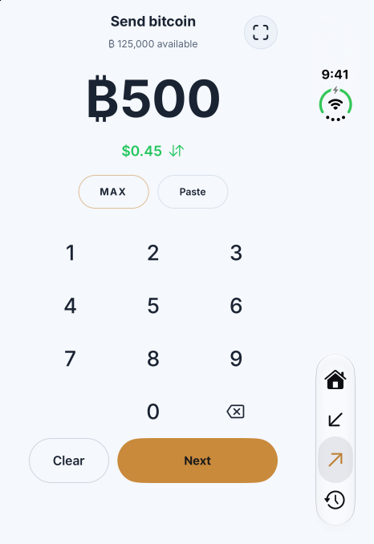
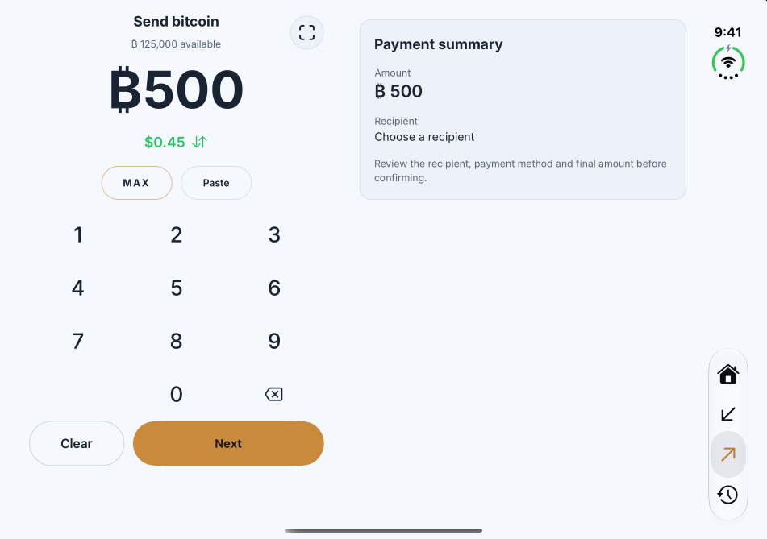
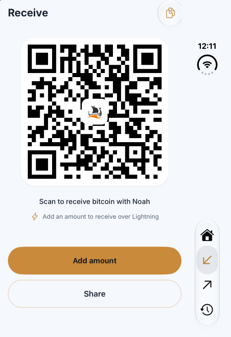
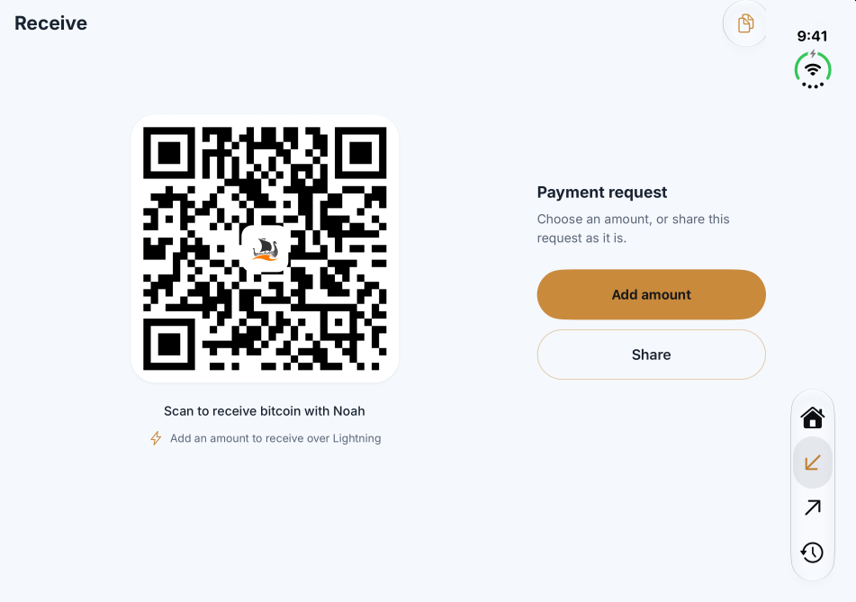
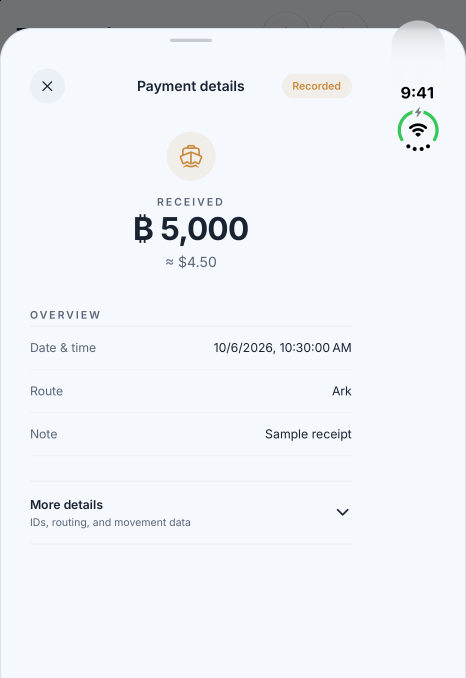
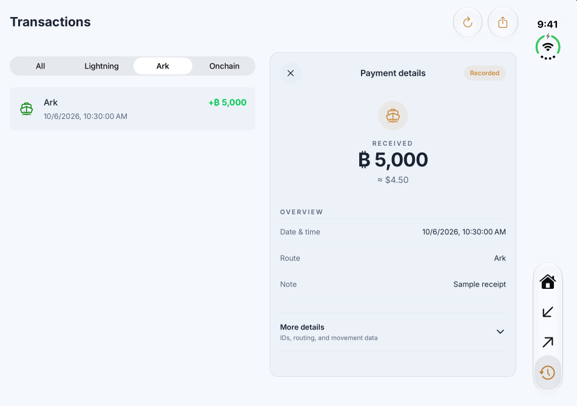
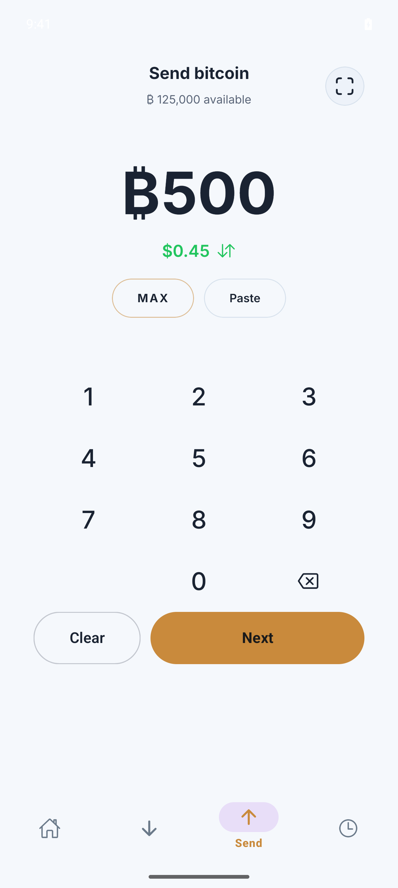
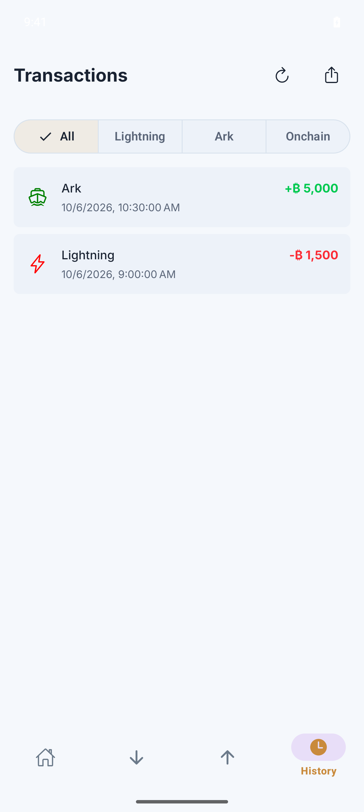

# Native simulator previews

The [expanded screen pass](expanded-pass/README.md) contains the latest real-regtest screenshots and unedited dark-mode recording. See the [screen coverage plan and results](coverage-plan.md).

## Initial core-tab preview

Captured October 7, 2026. These are real native UI captures using temporary in-memory sample wallet data. The QR is not payable; no live payment success is implied. The harness is not included in the app source.

[Download the unedited dark-mode recording](noah-iphone-duo-dark-open-raw.mp4) (H.264 MP4). One continuous native Simulator capture of the open inner display, copied byte-for-byte without trimming, overlays, speed changes, or transcoding.

[Download the 25-second edited screen recording](noah-iphone-duo-preview.mp4) (H.264 MP4, 1280 × 960, 30 fps, silent). It combines captures of the two simulator displays and briefly holds the final details frames.

| Screen | Closed | Open |
| --- | --- | --- |
| Home |  |  |
| Send |  |  |
| Receive |  |  |
| History |  |  |

Android UI regression checks passed on Pixel 9 Pro / Android 16 with the same sample-data approach.

| Send | History |
| --- | --- |
|  |  |

See the [engineering report](../iphone_duo_research.md) for exact validation boundaries and remaining release work.
