# Expanded screen pass

Captured October 7, 2026 from native regtest builds. These captures use actual local wallets, without sample data or app overrides. Empty-wallet states on ordinary phones are intentional. No seed or private key was captured. The localhost QR is for local regtest only.

[Download the unedited dark-mode Duo recording](noah-duo-expanded-dark-raw.mp4): 38.98 seconds, native H.264, one continuous inner-display capture of Settings, the recurring-payment editor, boarding, and Profile. No trimming, overlays, speed changes, or transcoding. The native encoded frame is 2006 × 2852 with display rotation metadata (landscape playback).

SHA-256: `06835129910961cd7909bc7823fb19140865099c2b7f5a562025a45de031dac5`.

| Duo screen | Closed | Open |
| --- | --- | --- |
| Settings | 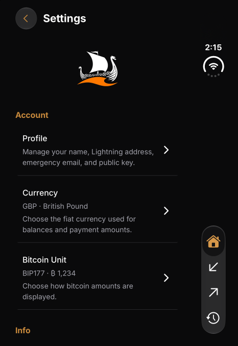 | 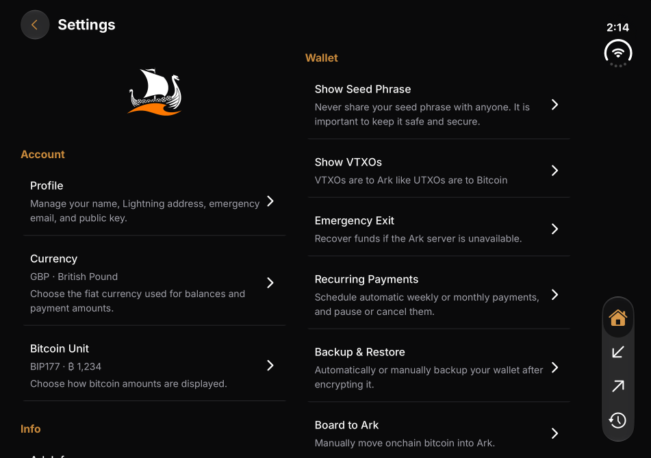 |
| QR | 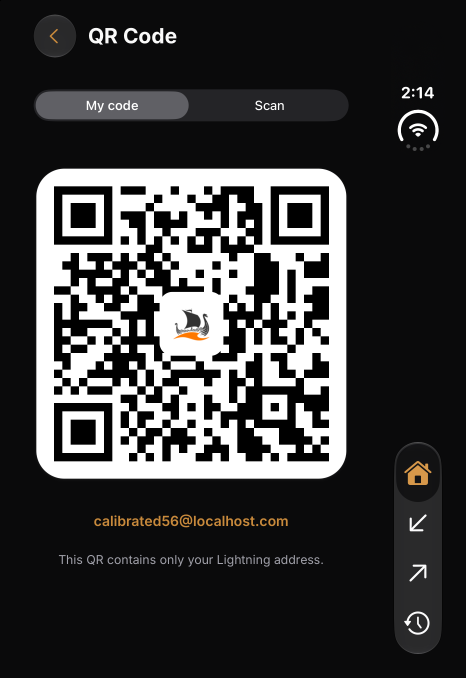 | 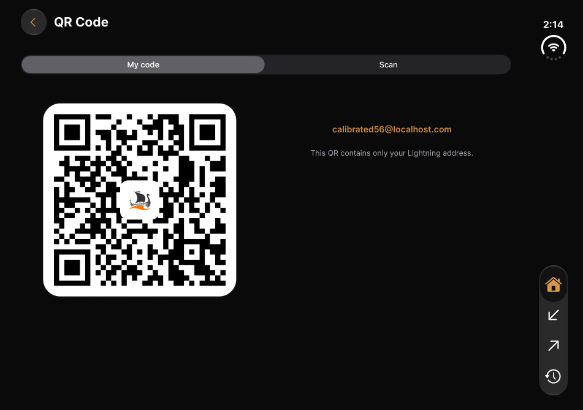 |
| Map selection | 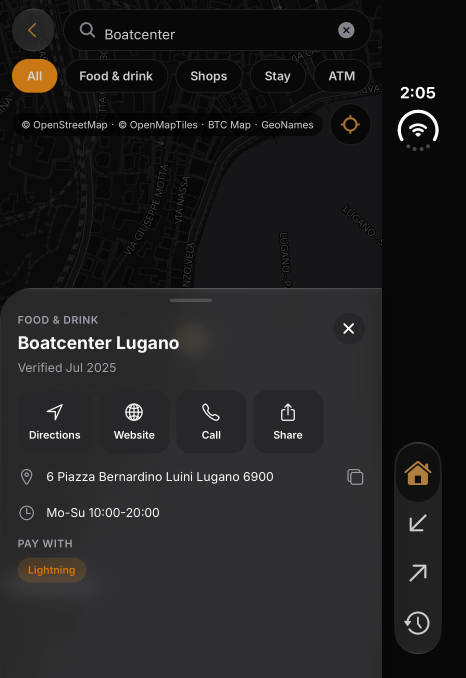 | 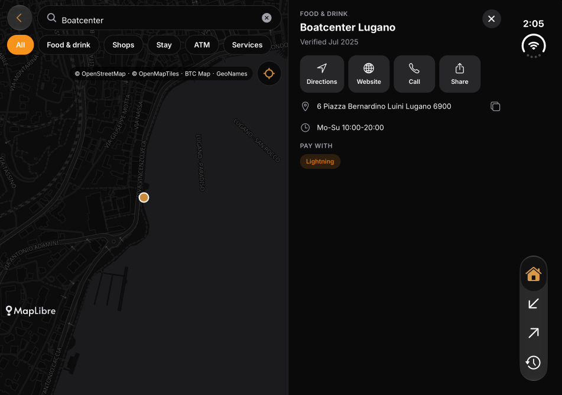 |
| VTXO selection before exit | 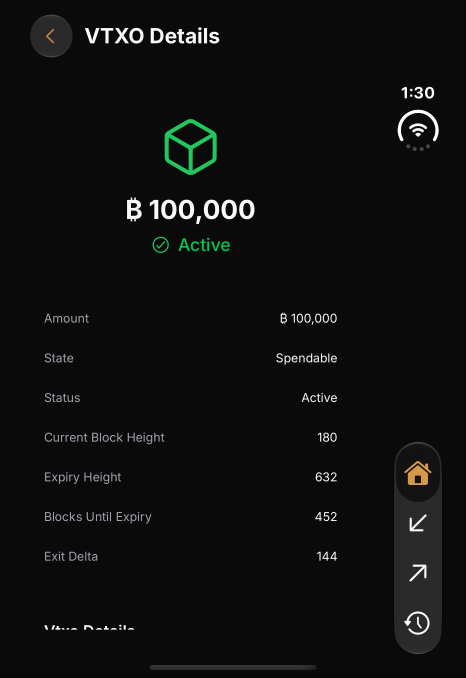 | 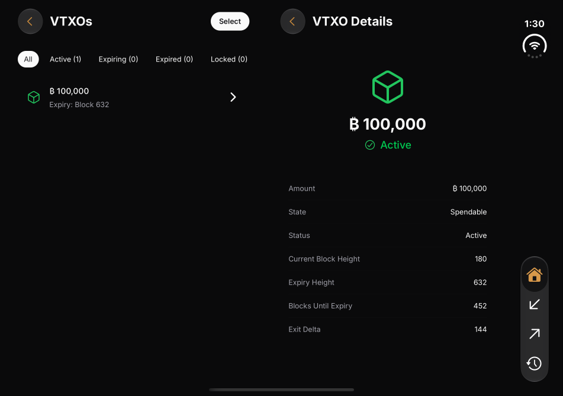 |

| Real exit claim | Recurring-payment draft |
| --- | --- |
| 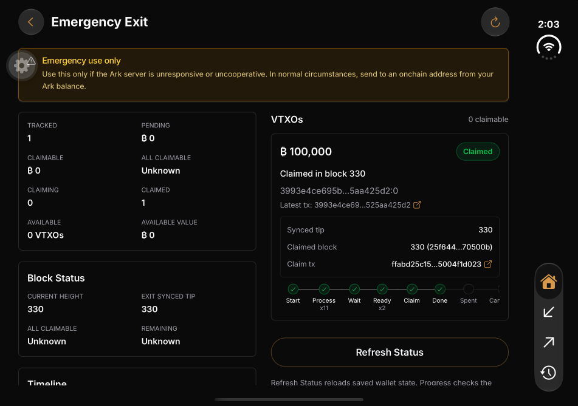 | 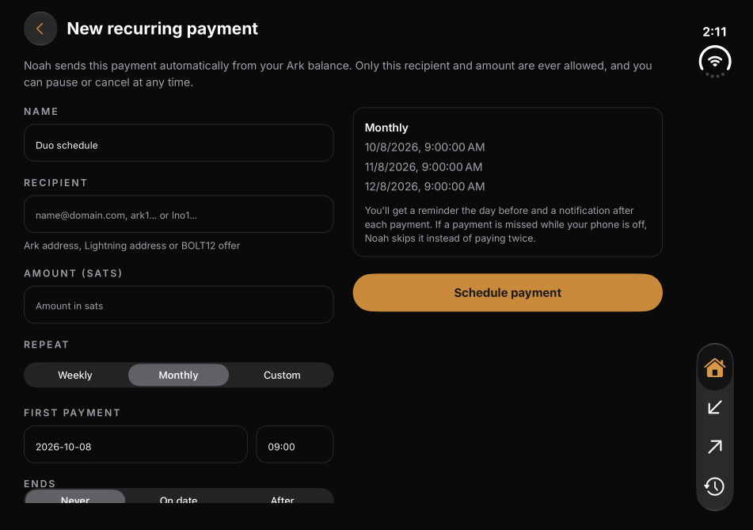 |

The claimed-exit capture includes Expo's development floating button. It is retained unchanged as evidence of the actual completed claim. Later captures and the video use Expo's built-in hide-button URL option.

| Normal iPhone | Android |
| --- | --- |
| 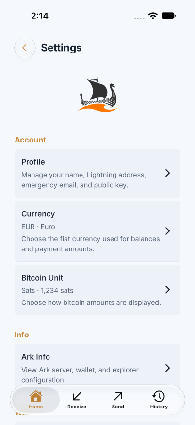 | 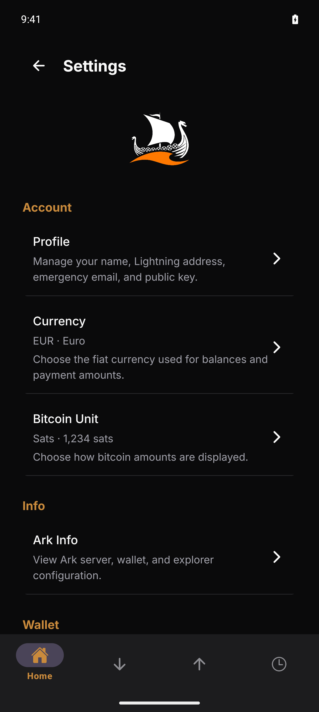 |
| 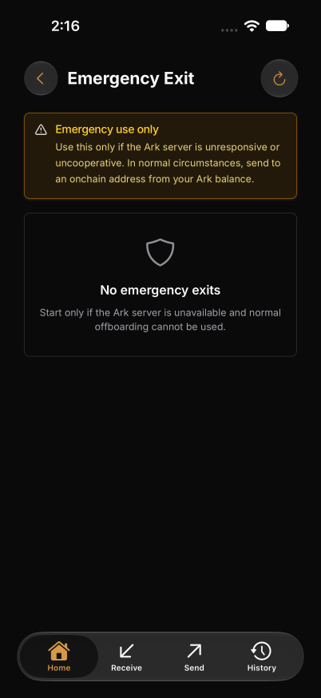 | 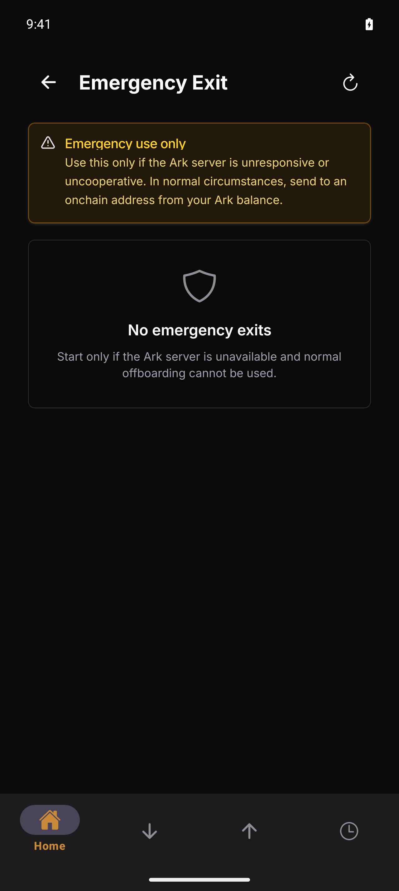 |
| 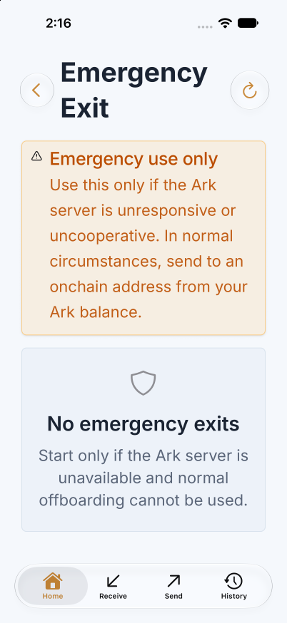 | 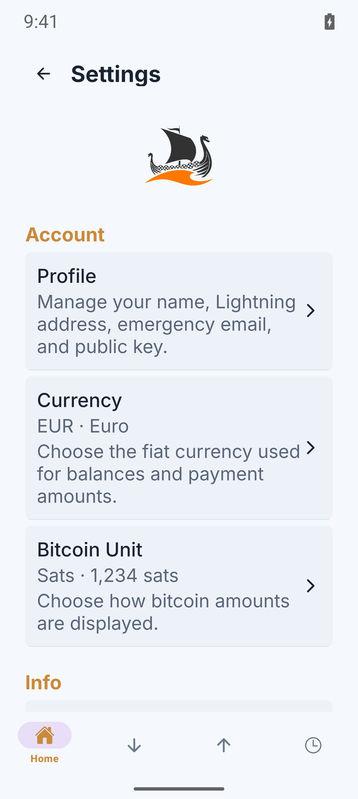 |

Additional screenshots in this directory cover boarding, Profile, claim confirmation, Receive, and accessibility text sizes. See [coverage and verification](../coverage-plan.md) for exact methods and untested states. The earlier sample-data core-tab images remain in the parent directory and are not evidence of a real payment.
